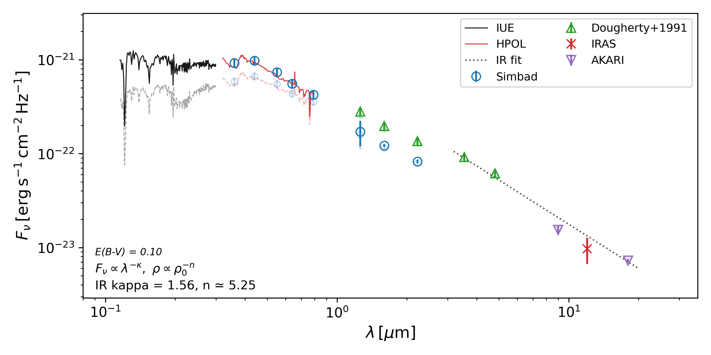

# SED Fitting for Be Star ome Ori

This repository contains scripts and data used to assemble and plot the spectral energy distribution (SED) of `omeOri` (omega Orionis).

## What is included

- `omeOri/`: example outputs from these SED scripts along with input spectra from IUE and HPOL, and manually created photometry file photometry_Doughery.dat taken from Dougherty+1991 near-IR photometry paper.
- `bandpasses/`: filter curves and zero-flux tables used for mag-to-Jy conversion.
- `make_phot_file_*.py` + `merge_phot_files.py`: scripts to create cleaned photometry files and merge them into one.
- `plot_IUE_ines_average.py` and `plot_HPOL_spectrum_average.py`: UV/optical spectrum averaging - needs to be run for plot_SED.py to include the averaged spectra
- `plot_SED.py`: creates the SED plot from merged photometry, and IUE and HPOL averaged spectra. Also fits a a power law to the IR photometry in a selected interval, and converts it to the density slope in Be star disks following Eq.20 of Vieira et al. (2015).

## Quick run

```bash
python plot_SED.py omeOri
```

## Example output


