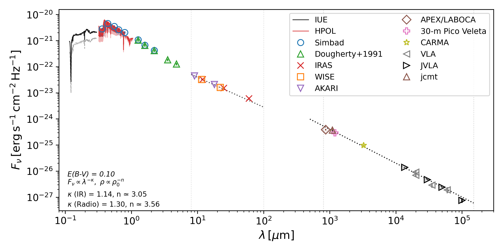

# SED Compiling and Fitting for Be Stars

This repository contains scripts and data used to assemble and plot the spectral energy distribution (SED) of Be stars and fit the IR and radio SED slopes. It is based on the scripts originally written for the Be star SED paper by [Klement et al. (2019)](https://ui.adsabs.harvard.edu/abs/2019ApJ...885..147K/).

## What is included

- `make_phot_file_*.py` + `merge_phot_files.py`: scripts to create cleaned photometry files and merge them into one.
  - AKARI, IRAS, and WISE - downloads data from the corresponding Vizier catalogs, discards flagged data points, performs color correction and unit conversion into Jy when needed
  - Simbad - downloads magnitudes from Simbad
  - Dougherty - reads Johnson magnitudes from *_dougherty_johnson.dat, which needs to be created manually based on Table 2 of [Dougherty et al. (1991)](https://ui.adsabs.harvard.edu/abs/1991AJ....102.1753D/) near-IR photometry paper.
  - **Radio photometry file has to be created manually (example included for bet CMi)**
- `plot_IUE_ines_average.py` and `plot_HPOL_spectrum_average.py`: UV/optical spectrum averaging - needs to be run for plot_SED.py to include the averaged spectra. Individual spectra have to be downloaded manually from the [INES](https://sdc.cab.inta-csic.es/cgi-ines/IUEdbsMY) (IUE) and [MAST](https://archive.stsci.edu/hpol/about.html) archives (HPOL).
- `plot_SED.py`: creates the SED plot from merged photometry, and IUE and HPOL averaged spectra. Also fits a power law to the IR photometry in a selected interval, and converts it to the density slope in Be star disks following Eq. 20 of [Vieira et al. (2015)](https://ui.adsabs.harvard.edu/abs/2015MNRAS.454.2107V/). It also includes optional dereddening if you input a non-zero value of E(B-V) in the script.
- `omeOri/`: example outputs from these SED scripts along with manually downloaded input spectra from IUE and HPOL, and manually created photometry file photometry_Dougherty.dat taken from [Dougherty et al. (1991)](https://ui.adsabs.harvard.edu/abs/1991AJ....102.1753D/) near-IR photometry paper.
- `bandpasses/`: filter curves and zero-flux tables used for mag-to-Jy conversion.

## Quick run

**Open each respective script in a Python IDE, modify inputs, and run!**

## Example output

